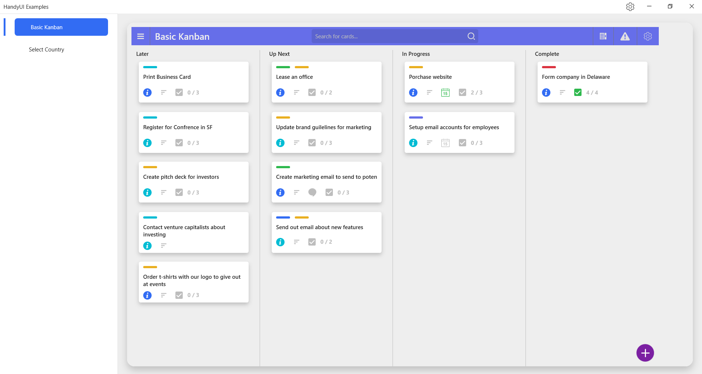
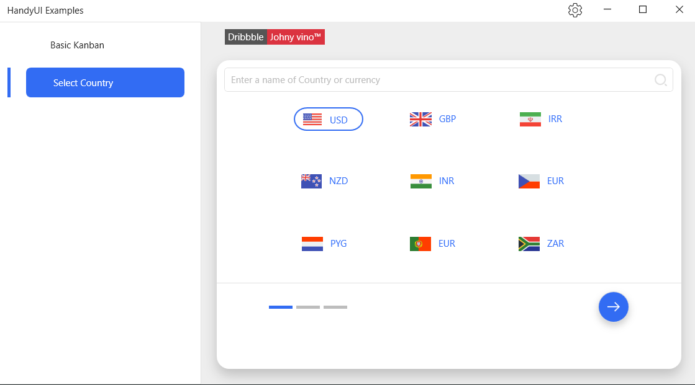

# HandyUI
We turn fancy UI designs into reality with the help of HandyControl Power.

We use [Dribbble](https://dribbble.com/) designs

`Note: The designs are created statically and are not dynamic. They may be created dynamically in the future. This is not a difficult task, it just takes a little time.`

